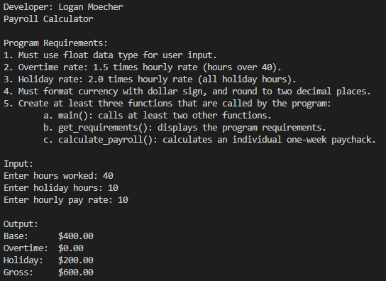
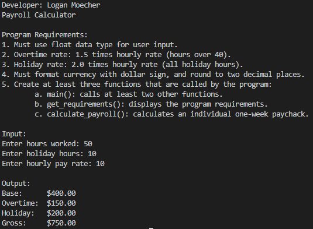
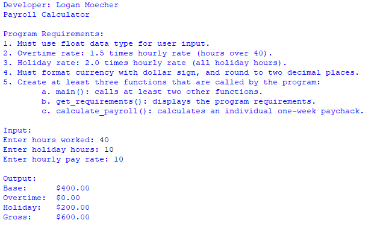
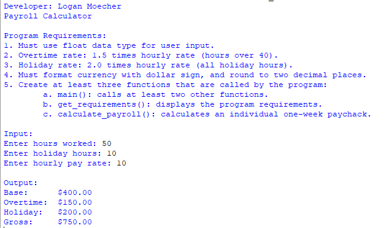
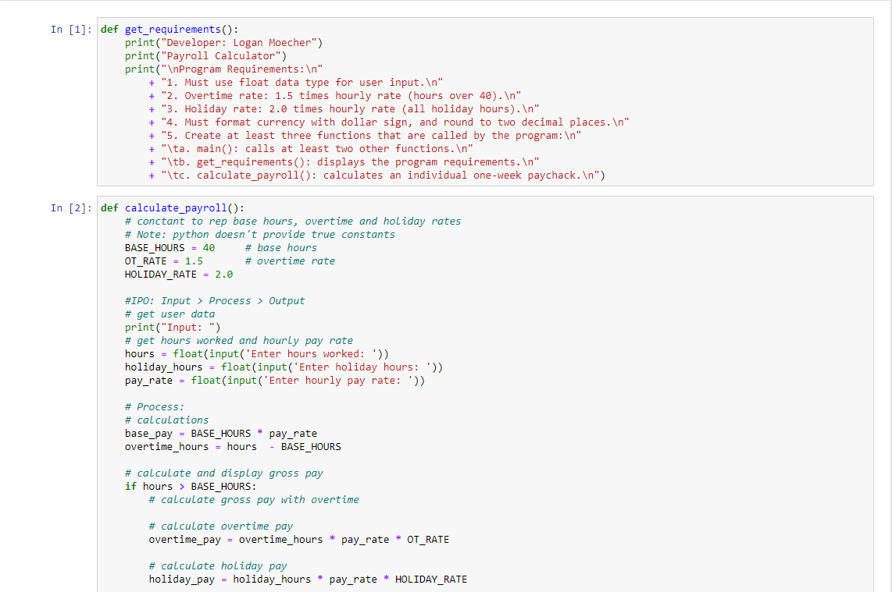
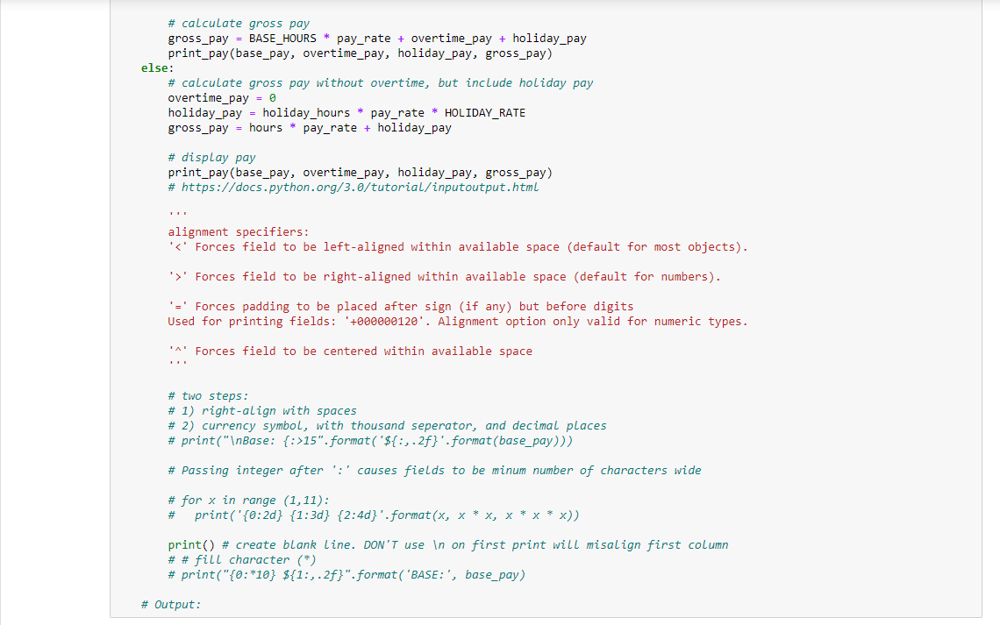
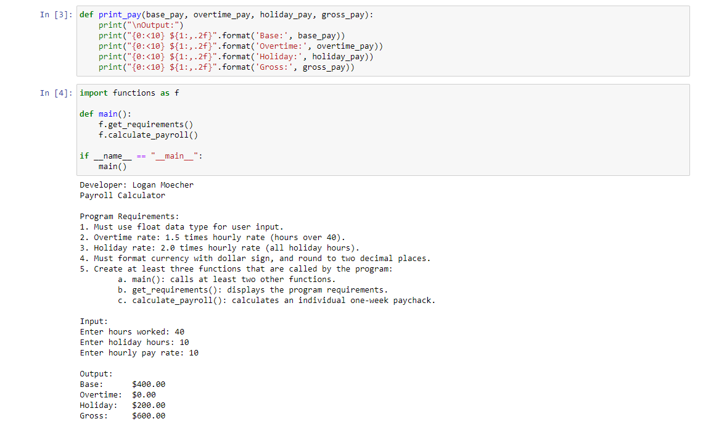
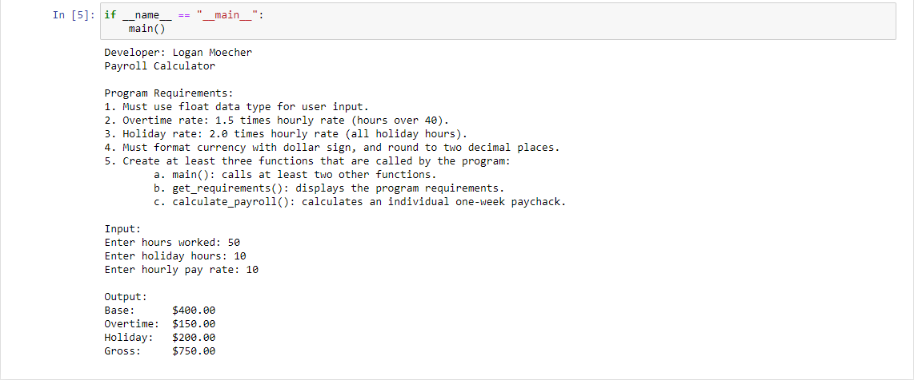
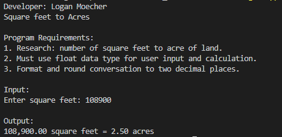
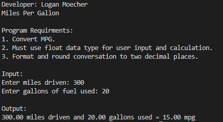

> **NOTE:** This README.md file should be placed at the **root of each of your repos directories.**
>
>Also, this file **must** use Markdown syntax, and provide project documentation as per below--otherwise, points **will** be deducted.
>

# LIS4369

## Logan Moecher

### Assignment 2 Requirements:

*Three Parts:*

1. Backward-engineer (using python) A2 screenshots
2. The Program should be organized with two modules (see CH. 4) 
	a. **function.py** module contains the following functions 
	i.	*get_requirements()* 
	ii.	*calculate_pay()* 
	iii.	*print_pay* 
	b. 	**main.py** module imports the **function.py** module, and calls the functions. 
3. Be sure to test program using **IDLE**, **VS Code**, and **Jupyter Notebook**

#### README.md file should include the following items:

* Screenshot of a2_payroll application running
* Link to A2 .ipynb file: [payroll.ipynb](a2_payroll/payroll.ipynb "A2 Jupyter Notebook")
* Skill sets 1, 2, and 3 screenshots

#### Assignment Screenshots:
*Screenshot of Assignment 2 running in VS Code with no overtime*:

*Screenshot of Assignment 2 running in VS Code with overtime*:

*Screenshot of Assignment 2 running in IDLE with no overtime*:

*Screenshot of Assignment 2 running in IDLE with overtime*:

*Screenshot of Assignment 2 running in Jupyter Notebook*:

#### Skill sets:

*Screenshot of Skill Set 1 running*:

*Screenshot of Skill Set 2 running*:

*Screenshot of Skill Set 3 running*:

