> **NOTE:** This README.md file should be placed at the **root of each of your repos directories.**
>
>Also, this file **must** use Markdown syntax, and provide project documentation as per below--otherwise, points **will** be deducted.
>

# LIS4369

## Logan Moecher

### Assignment 3 Requirements:

*Three Parts:*

1. Backward-engineer (using python) A3 screenshots
2. The Program should be organized with two modules (see CH. 4) 
	a. **function.py** module contains the following functions 
	i.	*get_requirements()* 
	ii.	*estimate_painting_cost()* 
	iii.	*print_painting_estimate*() 
	iv. 	*print_painting_percentage*() 
	b. 	**main.py** module imports the **function.py** module, and calls the functions. 
3. Be sure to test program using **IDLE**, **VS Code**, and **Jupyter Notebook**

#### README.md file should include the following items:

* Screenshots of a3_painting_estimator application running
* Link to A3 .ipynb file: [painting_estimator.ipynb](a3_painting_estimator/painting_estimator.ipynb "A3 Jupyter Notebook")
* Skill sets 4, 5, and 6 screenshots

#### Assignment Screenshots:

#### *Screenshot of Assignment 3 running in VS Code - cost percentage screenshot 1*:

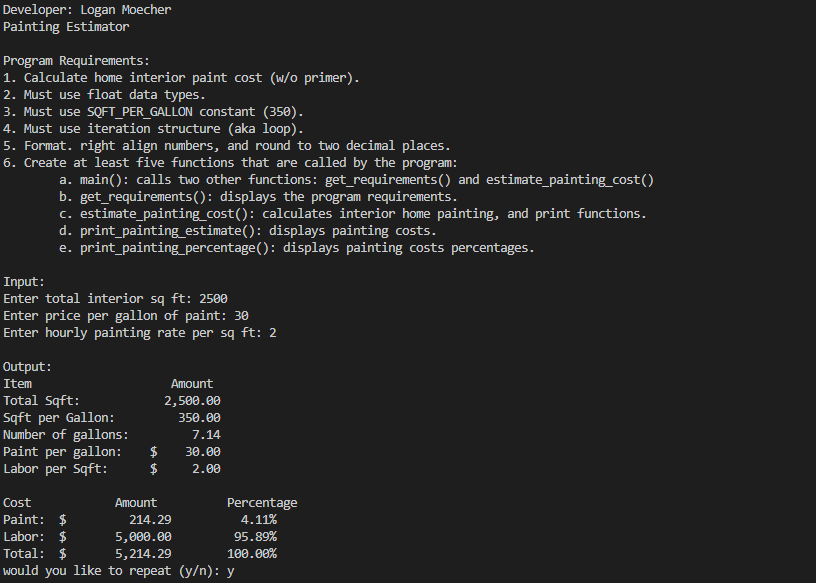

#### *Screenshot of Assignment 3 running in VS Code - cost percentage screenshot 2*:

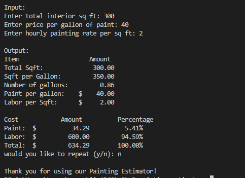

#### *Screenshot of Assignment 3 running in IDLE - cost percentage 1 screenshot*:

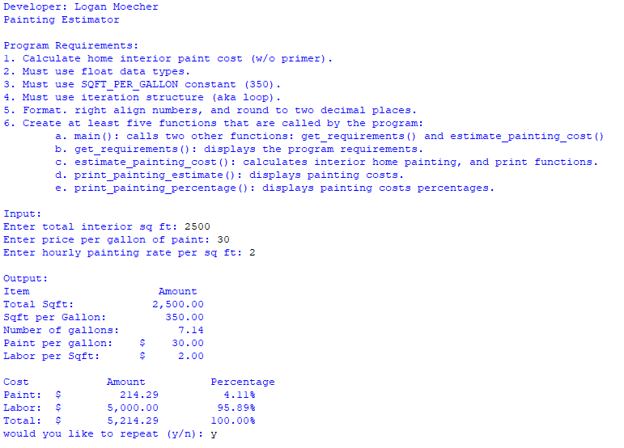

#### *Screenshot of Assignment 3 running in IDLE - cost percentage 2 screenshot*:

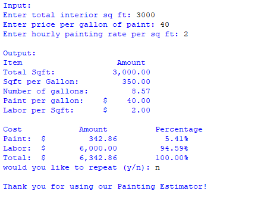

#### *Screenshot of Assignment 3 running in Jupyter Notebook*:

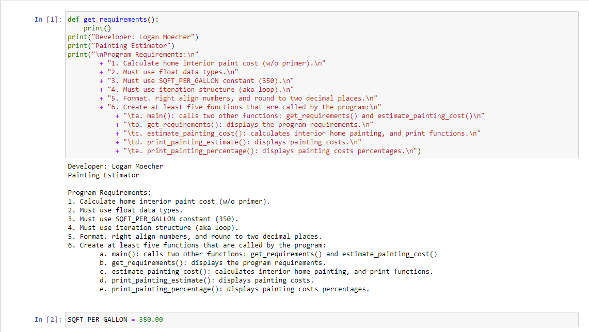
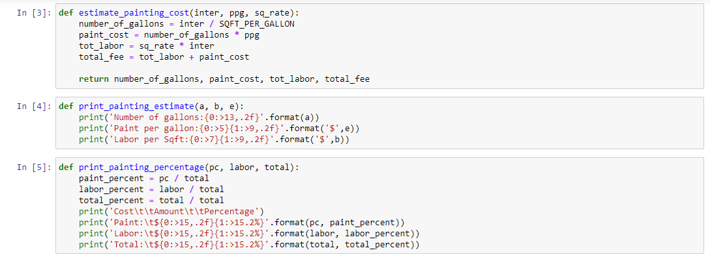
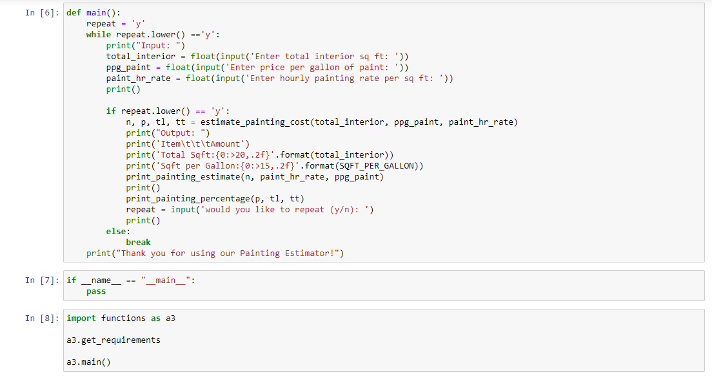
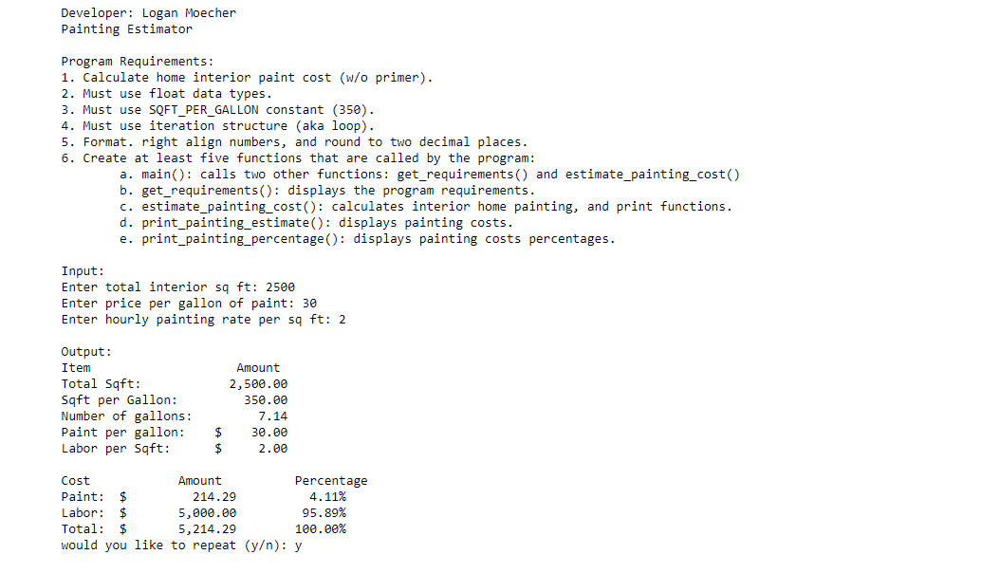
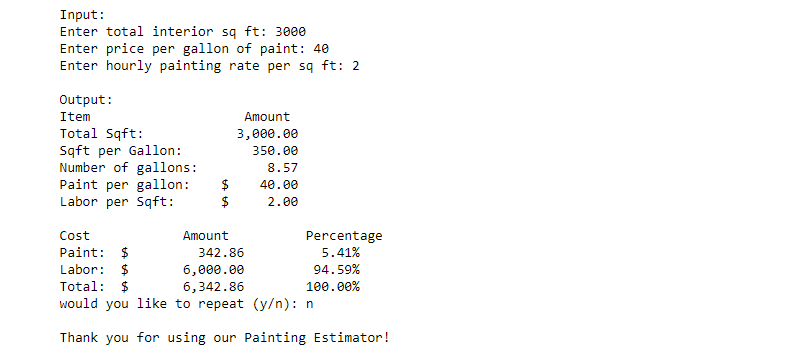

#### Skill sets:

#### *Screenshot of Skill Set 4 running*:

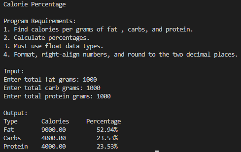

#### *Screenshot of Skill Set 5 running*:

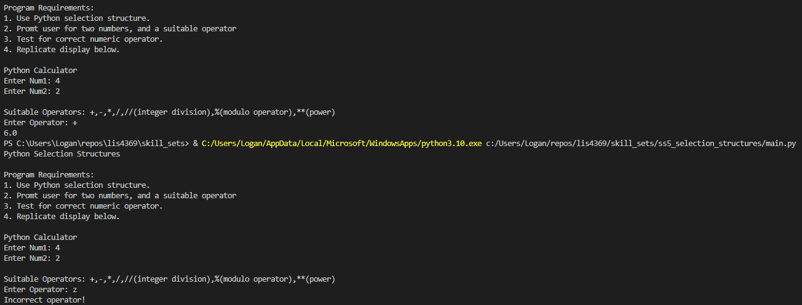

#### *Screenshot of Skill Set 6 running*:

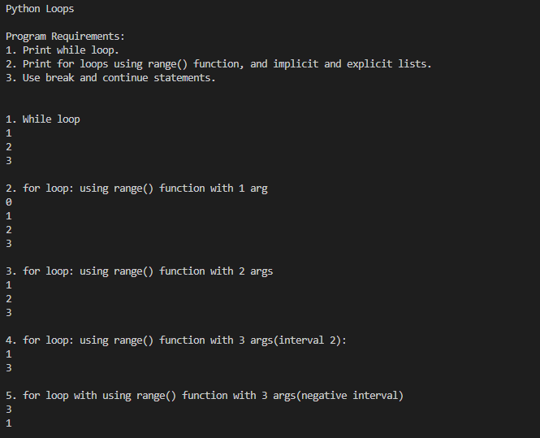
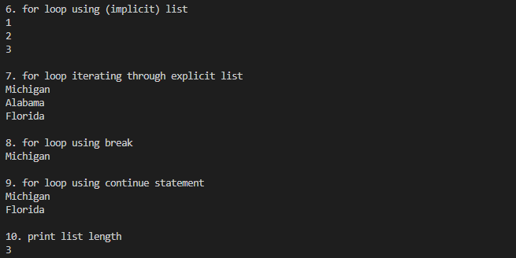
