# Constants 

## Section Contains:

*Three Parts:*

1. The description of what a *constant* or *const* is and why it is used.
2. Examples of when *const* is and is not used the correct way.
3. Screenshots of the code and what each outcome is. 

#### This file includes:

* Link to *Constants* code file: [Constants Code](constants_code/index.js "Constants file")
* Screenshots of the application running 

#

# Constant Description

* *Constant* or *const*: is a keyword that allows users to assign a name to value. Once *const*
assigns a name to that value, the value of that *const* cannot change. 

##### This image shows 3 blocks of code. One using the *let* variable and two using the *const* variable.

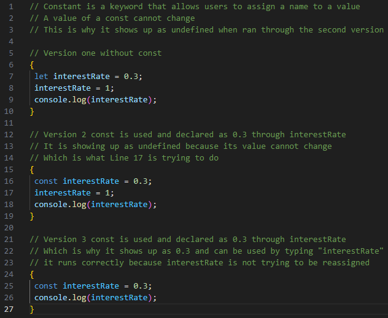

##### *HTML* code that was used for this application

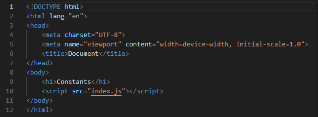

# Examples

### Example 1: Using *let*

> * #### *let* variable
 
> 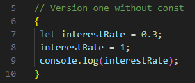

### Output 

> * *let* running in the Browser Console

> 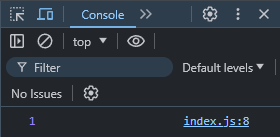

> * *let* running in the Command Prompt using node

> 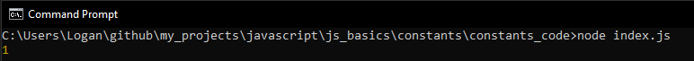

#

### Example 2: Using *const* the incorrect way

> * #### *const* variable used incorrectly

> 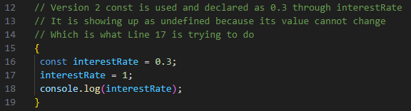

### Output

> * *const* running in the Browser Console

> 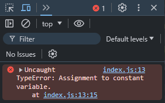

> * *const* running in the Command Prompt using node

> 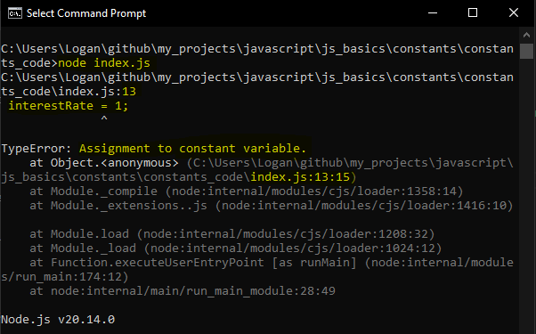

#

### Example 3: Using *const* the correct way

> * #### *const* variable used correctly

> 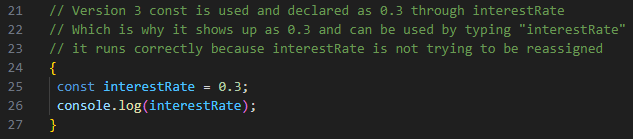

### Output

> * *const* running in the Browser Console

> 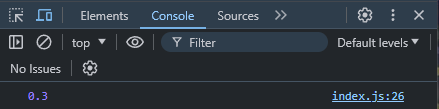

> * *const* running in the Command Prompt using node

> 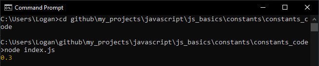

