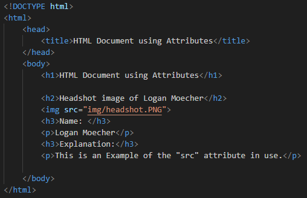
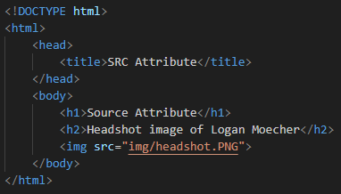
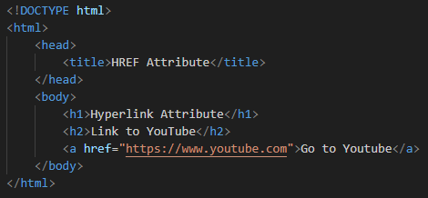
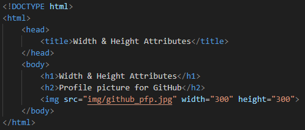
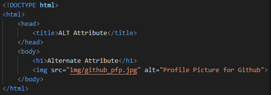
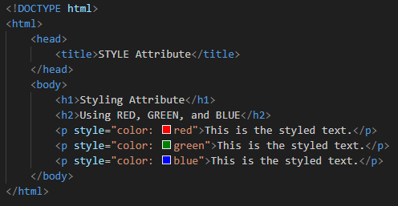
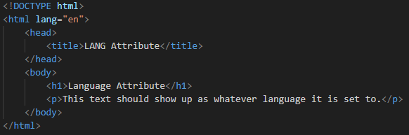
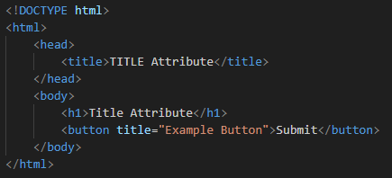

# HTML Attributes

## Section Contains:

*Two Parts*:

1. Description and Example of *HTML Attributes*

2. Descriptions and Examples of different types of *Attributes*

#### This file includes:

* Link to *Attributes* code file: [Attributes Code](attributes_code/index.html "Attributes file")
* Screenshots of the *HTML* file.

# 

## Attribute Description

* *HTML Attributes* provide more information about *HTML Elements*.
* All *elements* can have *attributes*.
* *Attributes* are always specified in the *start tag*.
* They usually are written in pairs "name/value": name="value".

### Example

* This is the same code used in the *Element* section

### Output

#

## Different Attributes and their Descriptions

1. *src* - an attribute of *img* specifies the path to the image to be displayed. 
2. *href* - an attribute of *a* the URL of the page the link goes to.
3. *width & height* - attributes of *img* provide information about the size of the images. 
4. *alt* - an attribute of *img* provides an alternate text for an image.
5. *style* - this attribute can be used to add different styles to an element. Styles like colors, sizes, fonts, etc. 
6. *lang* - an attribute of *html* tag set the languages that is displayed on the page.
7. *title* - this attribute defines extra information about an element.

#

## SRC Attribute

### Example

### Output

#

## HREF Attribute

### Example

### Output

#

## WIDTH & HEIGHT Attributes

### Example

### Output

#

## ALT Attribute

### Example

### Output

#

## STYLE Attribute

### Example

### Output

#

## LANG Attribute

### Example

### Output

#

## TITLE Attribute

### Example

### Output