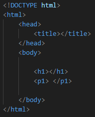

# HTML Elements

## Section Contains:

*Three Parts*:

1. Description and Examaples of *HTML Elements*. 

2. Description and Examples of *Nested HTML Elements*

3. Descripiton and Examples of *Empty HTML Elements*

### HTML Elements

#### Element Description

* The *HTML Element* is everything from the "start tag" to the "end tag"
* *HTML* tags are not case sensitive "H" works the same as "h".

#### Example

* The first "h1" is the start tag and the second "/h1" is the end tag.
* The "h1""/h1" and "p1""/p1" are examples of some HTML elements.

### HTML Nested Elements

#### Nested Element Description

* The *HTML Nested Element* is when the elements can contain other elements. 
* There are *Nested Elements* in every HTML document. 

#### Example 

* This example contains six elements (html, head, title, body, h1, and p1).
* "html" is the root element which defines the entire HTML document. 
* "body" defines the document's body.
* "h1" defines heading.
* "p1" defines a paragraph.
*  An "end tag" is needed on each for it to be displayed correctly

### HTML Empty Elements 

#### Empty Element Description

* This truly speaks for itself. An *Empty Element* is and element with no content. 

* The "br" tag is used to create a line break and is also known as an *Empty Element".
* You do not need an "end tag" for an empty element.

