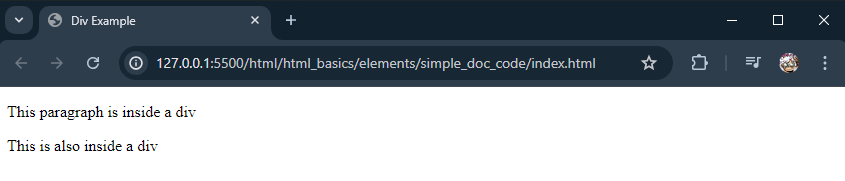
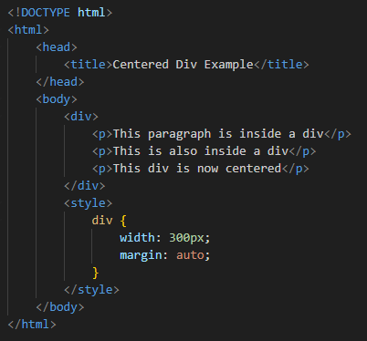
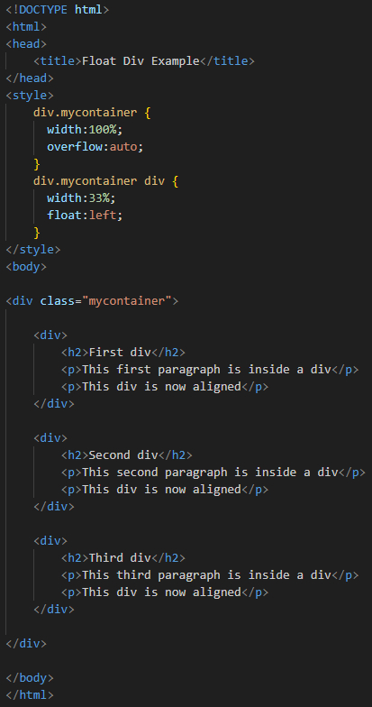
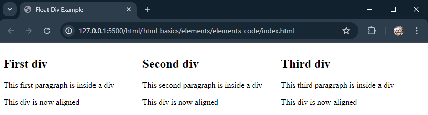
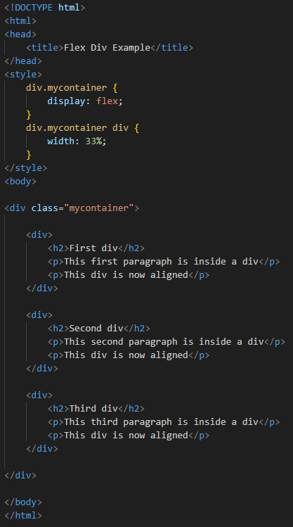
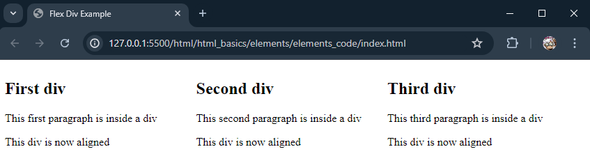
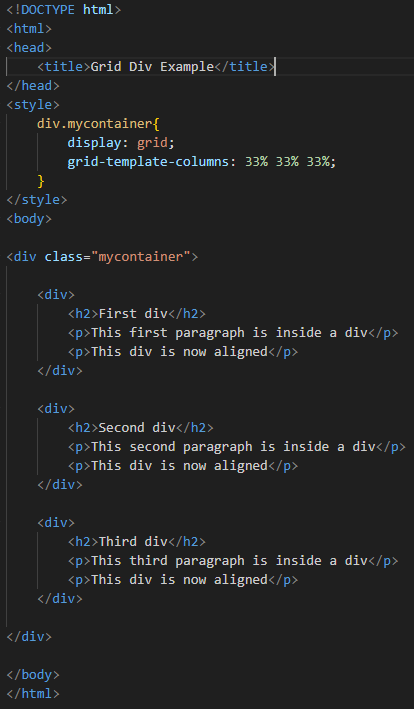
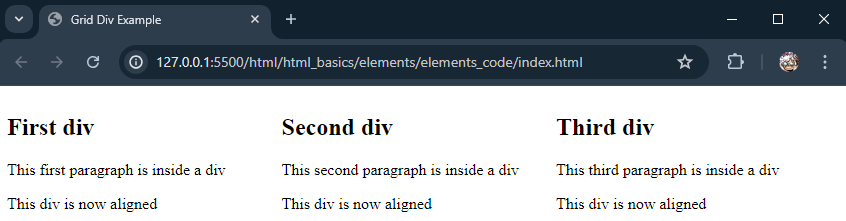

# HTML Elements

## Section Contains:

*Three Parts*:

1. Description and Examples of *HTML Elements*.

2. Description and Examples of *Nested HTML Elements*

3. Descripiton and Examples of *Empty HTML Elements*

#### This file includes:

* Link to *Constants* code file: [Elements Code](elements_code/index.html "Elements file")
* Screenshots of the *HTML* file.

#

# HTML Elements

## Element Description

* The *HTML Element* is everything from the "start tag" to the "end tag"
* *HTML* tags are not case sensitive "H" works the same as "h".

### HTML Document Example Explained

* The "*!DOCTYPE html*" declaration defines the document as an *HTML5* document.
* The "*html*" element is the root element for an *HTML* page.
* The "*head*" element contains meta information about the *HTML* document.
* The "*title*" element specifies a title for the *HTML* document (This is shown in the website tab or page).
* The "*body*" element defines the document's body. 
* The "*h1*" element defines a large heading.
* The "*p*" element defined a paragraph.

### Example

* This is what a basic *HTML* document looks like before anything is truly done to it.
* The first "h1" is the start tag and the second "/h1" is the end tag.
* The "h1""/h1" and "p""/p" are examples of some HTML elements.

### Output

#

# HTML Document using other Elements

## HTML Document Example Explained

* The "*img*" element imbeds images into the *HTML* document.
* The "*h2*" element defines a large heading but not the largest.
* The "*h3*" element defines a medium sized font, smaller than "h1" and "h2". This continues between "h1" and "h6"

### Example 

### Output 

* This is what appears when using an "img file".
* This can all be restructured and improved visually through *CSS*.

### HTML Document which is slightly enhanced by CSS

### Example

### Output

* *CSS* is used to make it appear as though it is a basic verison of a Tweet. 

#

# Div

### Div Description 

* A "*div*" or *division* is an element used to group content on a webpage for organization. 
* Acts as a container for the other *HTML* elements, allowing the users to apply styles and layouts to the webpage effectively.
* A *div* is commonly used for layout structure, styling and theming, and for manipulation through *JavaScript*.

### Example

### Output

* These two paragraphs are group together because of being inside the div. 

## Centering a Div

* If a "*div*" is not 100% wide and want it centered. Set the CSS property *margin* to *auto*

### Example

### Output

## Aligning a Div

* The most common way to align a *div* is to use the *float* property.
* The *float* property is used for positioning and formatting content.
* This shows each conatainer next to each other, rather than being stacked.
* The *flex* property can also be used, which makes it easier to design a responsive layout without using float.
* The *grid* property is one more that can be used instead. This designs the container with a grid, and the width of each column needs to be inputed.  

### Example using Float Property

### Output

#

### Example using Flex Property

### Output

#

### Example using Grid Property

### Output

# HTML Nested Elements

## Nested Element Description

* The *HTML Nested Element* is when the elements can contain other elements. 
* There are *Nested Elements* in every HTML document. 

### Example 

* This example contains six elements (html, head, title, body, h1, and p1).
* "html" is the root element which defines the entire HTML document. 
*  An "end tag" is needed on each for it to be displayed correctly.

#

# HTML Empty Elements 

## Empty Element Description

* This truly speaks for itself. An *Empty Element* is and element with no content. 

### Example

* The "br" tag is used to create a line break and is also known as an *Empty Element".
* You do not need an "end tag" for an empty element.

