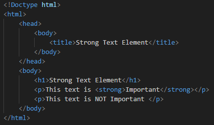

# HTML Formatting

## Section Contains:

*Two Parts*:

1. Description of *HTML Formatting*.

2. Descriptions and Examples of different ways to Format an HTML file.

#### This file includes:

* Link to *Attributes* code file: [Formatting Code](formatting_code/index.html "Formatting file")
* Screenshots of the *HTML* file.

# 

## Formatting Description

* *Formatting* elements were designed to have the *HTML* document display special text.

## Different Formatting Elements

* "*b*" - Bold text
* "*strong*" - Important text
* "*i*" - Italic text
* "*em*" - Emphasized text
* "*mark*" - Marked text
* "*small*" - Smaller text
* "*del*" - Deleted text
* "*ins*" - Inserted text
* "*sub*" - Subscript text
* "*sup*" - Superscript text

#

## Bold Text

* "*b*" - Bold text

### Example

### Output

#

## Strong Text

* "*strong*" - Important text

### Example

### Output

* The Bold and Strong elements are very similar with how they look.

#

## Italic Text

* "*i*" - Italic text

### Example

### Output

#

## Emphasized Text

* "*em*" - Emphasized text

### Example

### Output

* The Italics and Emphasize elements are also very similar with how they look.

#

## Marked Text

* "*mark*" - Marked text

### Example

### Output

#

## Smaller Text

* "*small*" - Smaller text

### Example

### Output

#

## Deleted Text

* "*del*" - Deleted text

### Example

### Output

#

## Inserted Text

* "*ins*" - Inserted text

### Example

### Output

#

## Subscript Text

* "*sub*" - Subscript text

### Example

### Output

#

## Superscript Text

* "*sup*" - Superscript text

### Example

### Output

