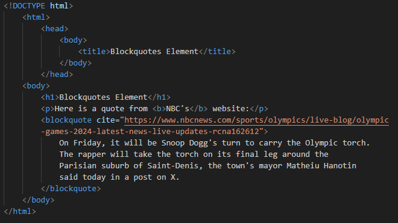
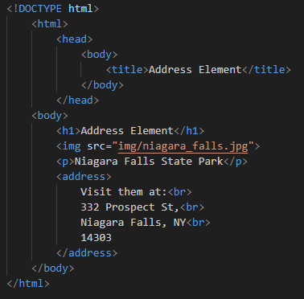
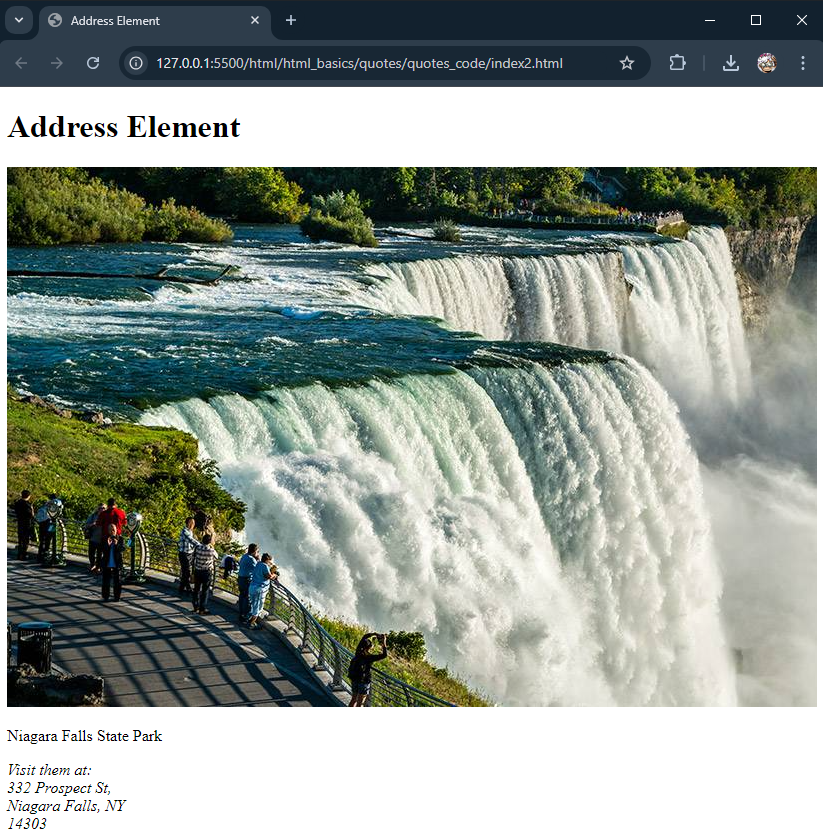

# HTML Quotes / Citations

## Section Contains:

*Two Parts*:

1. Description of *HTML Quotes* and *Citations*.

2. Descriptions and Examples of different quotes elements in an HTML file.

#### This file includes:

* Link to *Quotes / Citations* code file: [Quotes / Citations Code](quotes_code/index.html "Quotes / Citations file")
* Screenshots of the *HTML* file.

# 

## Quotes Description

* *Quote* / *Citation* Elements are formatted using specific tags to endure proper semantic meaning and style. 

## Different Quotes / Citations elements

* *blockquotes* - Used for longer quotation, typically displayed as a block of text indented from the main content.
* *q* - Used for short inline quotations within a paragraph. 
* *cite* - Used to refernce the source of a quote or piece of content. This is often used within a "*blockquote*" or "*q*" tags to provide citations.
* *abbr* - Used to define abbreviations or acronyms. The "*Title*" attribute is used to provide the full meaning.
* *address* - Used to define contact information for an owner/author of an article or document.  
* *bdo* - stands for "*Bi-Directional Override*" Used to override the current text direction.

#

## Blockquotes

* *blockquotes* - Used for longer quotation, typically displayed as a block of text indented from the main content.
* The Browser will usually indent the *blockquote* element

### Example

### Output

#

## Quotes "short"

* *q* - Used for short inline quotations within a paragraph.
* Browsers tend to inert quotations around the *q* element

### Example

### Output

#

## Citations

* *cite* - Used to refernce the source of a quote or piece of content. This is often used within a "*blockquote*" or "*q*" tags to provide citations.
* The text inside the *cite* element is render in italic. 

### Example

### Output

#

## Abbreviations

* *abbr* - Used to define abbreviations or acronyms. The "*Title*" attribute is used to provide the full meaning. 
* They give useful information to browsers, search-engines and translation systems. 

### Example

### Output

#

## Address

* *address* - Used to define contact information for an owner/author of an article or document. 
* This can be a phone number, email address, URL, physical address, social media handle, etc. 
* The text inside the element for *address* usually is shown in italic, and in the browser the line will break before and after an *address* element.  

### Example

### Output

#

## Bi-Directional Override

* *bdo* - stands for "*Bi-Directional Override*" Used to override the current text direction.

### Example

### Output

#

