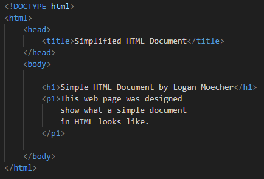
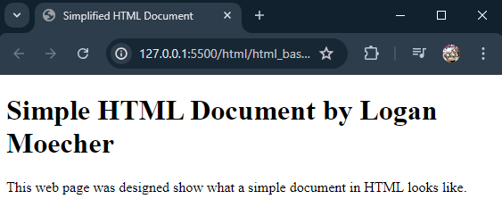

# Simple HTML Document
This is the section designed to show that I've covered the Basics of *HTML*.

## Section Contains:

*Two Parts*:

1. Example of a simple *HTML* Document

2. Descriptions for each part explaing what it does

### HTML Document

#### Example

* This is what a basic *HTML* document looks like before anything is truly done to it.

#### Output

* This is what appears in the Browser when the *HTML* document is live.

### HTML Document Example Explained

* The *!DOCTYPE html* declaration defines the document as an *HTML5* document.
* The *html* element is the root element for an *HTML* page.
* The *head* element contains meta information about the *HTML* document.
* The *title* element specifies a title for the *HTML* document (This is shown in the website tab or page).
* The *body* element defines a large heading. 
* The *h1* element defines a large heading.
* The *p* element defined a paragraph.

