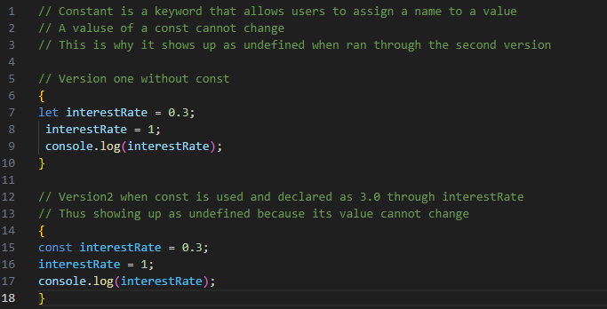
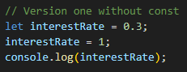
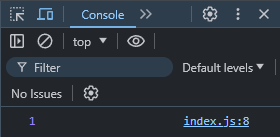
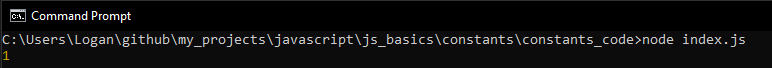
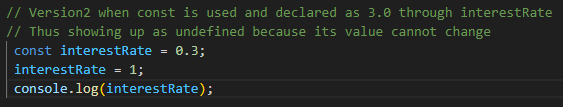

# Constants 

## Section Contains:

*Three Parts:*

1. The description of what a *constant* or *const* is and why it is used.
2. Examples of when *const* is and is not used the correct way.
3. Screenshots of the code and what each outcome is. 

#### This file includes:

* Link to Constants code file [constants_code](constants_code/index.js "Constants file")
* Screenshots of the application running [Constants Img](constants/img "Image Folder")

## Constants Description

* *Constant* or *const* is a keyword that allows users to assign a name to value. Once *const*
assigns a name to that value, the value of that *const* cannot change. 

* This image shows 3 blocks of code. One using the *let* variable and two using the *const* variable.

## Examples

### Example 1: Using *let*

* ####*let* variable 

#### What Happens? 

* *let* running in the browser console using HTML

* *let* running in the Command Prompt using node

### Example 2: Using *const* the incorrect way

* ####*const* variable used incorrectly

#### What Happens?

* *const* running in the browser console using HTML 

* *let* running in the Command Prompt using node

