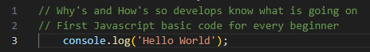
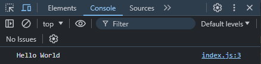

# Hello World Beginner Project 

## Section Contains:

*Three Parts*:

1. The *Hello World* application 
2. Screenshot of *Hello World* running on the Browser Console
3. Screenshot of *Hello World* running in the Command Prompt

#### This file includes: 

* Link to *Hello World* code file: [Hello World](hello_world_code/index.js "Hello World file")
* Screenshots of the *Hello World* application running

# Hello World application

##### This image shows the *Hello World* code that creates and runs the application 

##### *HTML* code that was used for this application

## Hello World Application Running

##### This image shows the *Hello World* application running in the Browser Console

##### This image shows the *Hello World* application running in the Command Prompt

