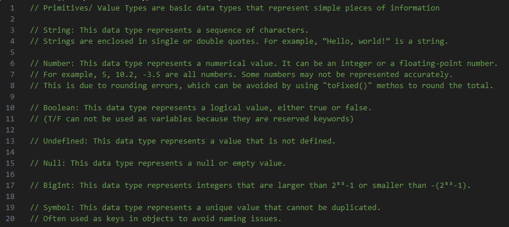

# Primitives / Value Types

## Section Contains:

*Eight Parts*:

1. The Decscription of *Primitives*/*Value Types* and why they are used.
2. Description and Examples of *Strings*
2. Description and Examples of *Numbers*
2. Description and Examples of *Booleans*
2. Description and Examples of *Undefined*
2. Description and Examples of *Null*
2. Description and Examples of *BigInt*
2. Description and Examples of *Symbols*

#### This file includes:

* Link to the *Primitives* / *Value Types* file [Primitives / Value Types](primitives_value_types_code/index.js "Primitives / Value Types file")
* Screenshots of the each *Value Type* in use and the output

##### This image shows quick Descriptions of each that will be covered later in this section.

##### *HTML* code that was used for this application

## Primitives / Value Types Description:

* *Primitives*/*Value Types*: are basic data types that represent simple pieces of information
* These *Value Types* are:
> * String
> * Number
> * Boolean
> * Undefined
> * Null
> * BigInt
> * Symbol

