# Reference Types

## Section Contains:

*Four Parts*: 

1. The Decscription of *Reference Types* and why they are used.
2. Description and Examples of *Arrays*
3. Description and Examples of *Functions*
4. Description and Examples of *Objects*

#### This file includes:

* Link to the * Reference Types* file: [Reference Types](reference_types_code/index.js "Reference Types")
* Screenshots of each *Reference Type* application and the output.

##### *HTML* code that was used for these applications

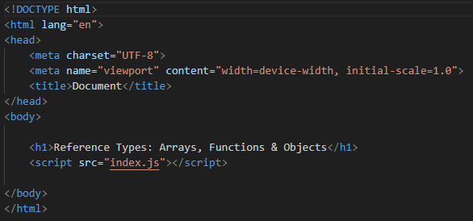

# Reference Types Description:

* *Reference Types*: are objects that are stored and manipulated via references (or addresses) rather than by their actual values.
* These *Refernce Types* are:
> * Array
> * Function
> * Object

# Array

* *Array*: is a data structure that we use to represent a list of items.
* When using an *Array* index numbers start at 0 not 1, (0,1,2,3).
* "[ ]" these brackets are called an array literal and indicate an empty array.

### Example

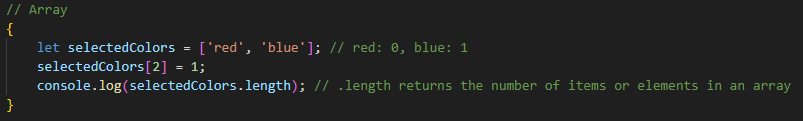

### Output 

##### *Array* application running in the Browser Console

##### *Array* application running in the Command Prompt

# Function

* *Function*: these are a set of statements that perform a task or calculates and returns a value.
* The *parameter* is set at the time of declaration.
* The *argument* is at the actual value that supplies that *parameter*. 
* *Functions* can have multiple *parameters*, to add more use ",".
* Realworld apps have thousands of functions runnning together to provide the functionality of that application.
* Three different Function examples.

### Example 

##### Ex. 1

### Output 

##### *Function* application running in the Browser Console

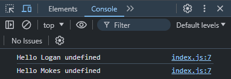

##### *Function* application running in the Command Prompt

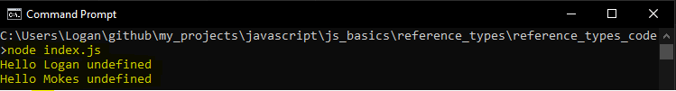

##### Ex. 2

### Output 

##### *Function* application running in the Browser Console

##### *Function* application running in the Command Prompt

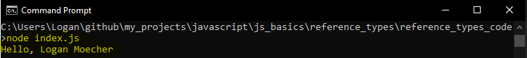

##### Ex. 3

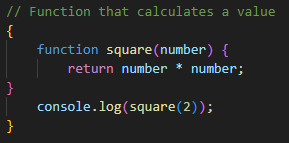

### Output 

##### *Function* application running in the Browser Console

##### *Function* application running in the Command Prompt

# Objects 

* *Object*: These are the properties of the variables.
* Two ways of changing the name of *person* and accessing the properties.
* *Dot Notation* & *Bracket Notation*.
* Most stick to *Dot Notation* due to it not being as consice as *Bracket Notation*.

### Example 

### Output 

##### *Object* application running in the Browser Console

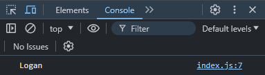

##### *Object* application running in the Command Prompt

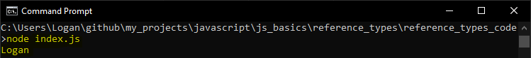

## Dot Notation

### Example 

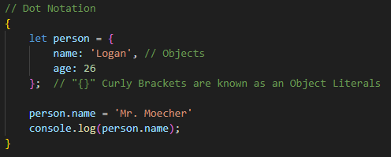

### Output 

##### *Dot* application running in the Browser Console

##### *Object* application running in the Command Prompt

## Dot Notation

### Example 

### Output 

##### *Bracket* application running in the Browser Console

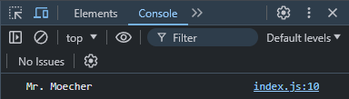

##### *Object* application running in the Command Prompt

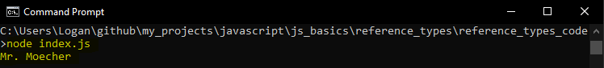