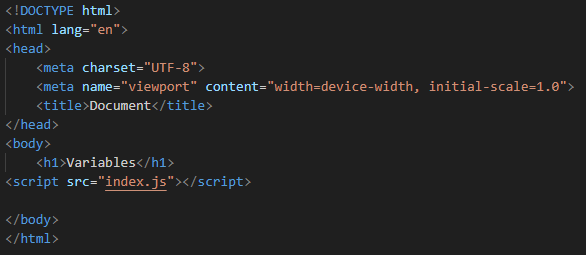

# Variables 

## Section Contains:

*Two Part*: 

1. The Description of *Variables* and why they are used. 
2. Description and Examples of *Variables*.

#### This file includes: 

* Link to the *Variables* file: [Variables] (variables_code_/index.js "Variable")
* Screenshots of each *Variable* application and the output.

##### *HTML* code that was used for these applications

# Variable Description: 

* *Variable*: They are used to store data temporarily in a computers memory.
* *Variables* cannot be a reserved Keyword and should be meaningful.
* *Variables* cannot start with a number (1name), space (name 1), or hyphen(-). 
* *Variables* are case sensitive.

