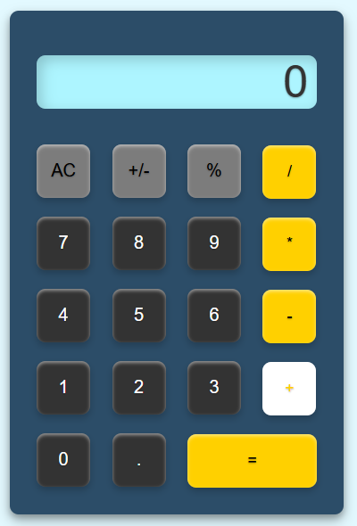
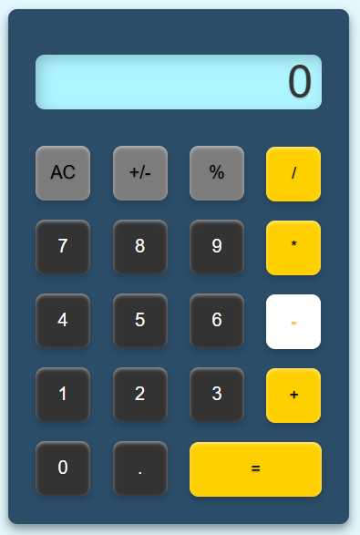
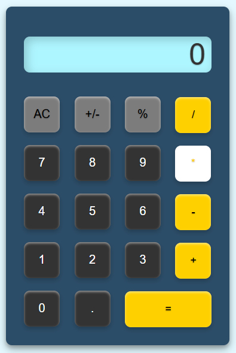
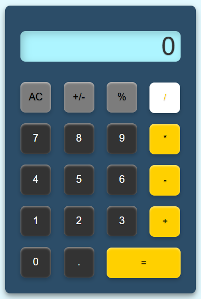

# Project 1: Calculator 

## Section Contains:

*Two Parts*

1. Project description

2. Screenshots with descripitons for each

#### Link to the files

* Link to *Calculator* html file: [Calculator html file](index.html "html file")
* Link to *Calculator* css file: [Calculator css file](style.css "css file")
* Link to *Calculator* js file: [Calculator js file](function.js "js file")

## Project Description

* I created a JavaScript-powered calculator with an intuitive, responsive UI for basic arithmetic operations. It uses event listeners and DOM manipulation to provide smooth, instant feedback on user actions. The code is modular, ensuring readability and easy maintenance, while the design keeps the interface clean and accessible for a seamless user experience.

## Calculator in use Screenshots

### Example 1

* Highlighted operator buttons show that they are in use.
* Addition
* Subtraction
* Multiplication
* Division 

    
    
    
    

