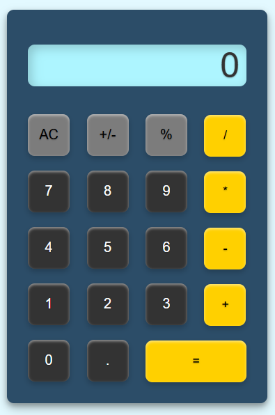

# Project 1: Calculator 

## Section Contains:

*Two Parts*

1. Project description

2. Screenshots with descripitons for each

#### Link to the files

* Link to *Calculator* html file: [Calculator html file](index.html "html file")
* Link to *Calculator* css file: [Calculator css file](style.css "css file")
* Link to *Calculator* js file: [Calculator js file](function.js "js file")

## Project Description

### Digital Calculator

* I created a JavaScript-powered calculator with an intuitive, responsive UI for basic arithmetic operations. It uses event listeners and DOM manipulation to provide smooth, instant feedback on user actions. The code is modular, ensuring readability and easy maintenance, while the design keeps the interface clean and accessible for a seamless user experience.

## Descritiptions of Calculators Functions

### Highlighted Operator Buttons

* The highlighted operator buttons on a calculator are visually emphasized to indicate active or selected operations. These buttons, such as +, -, ×, ÷, or =, are highlighted with a different color to make them stand out and clearly show which operation the user is performing. This visual cue helps guide users through the calculation process, ensuring they know which arithmetic operation is selected before entering numbers or completing a calculation.
1. *Addition* 
2. *Subtraction* 
3. *Multiplication* 
4. *Division*

#### Ex. 1

    
    
    
    

#### Ex. 2 Calculator using *Addition*

* 11 + 22 = 33 

    
    
    
    

### Positive/Negative Button "+/-"

* The +/- button on a calculator allows the user to toggle the sign of the current number, switching between positive and negative values. It is commonly used for quickly changing the sign of a number during calculations. When pressed, it either adds a minus sign in front of the number or removes it, making it a useful tool for operations involving both positive and negative numbers.

