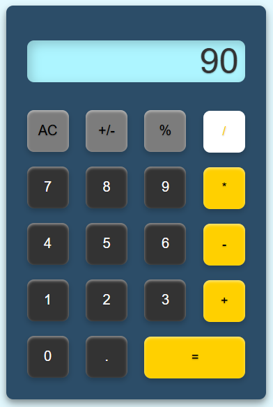
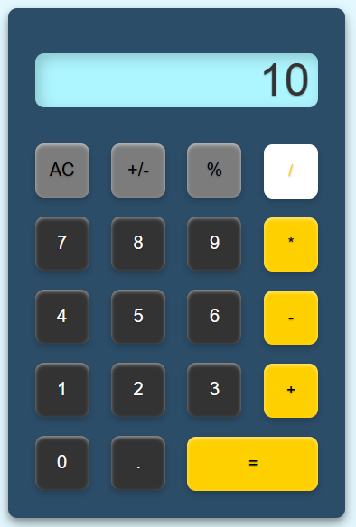

# Project 1: Calculator 

## Section Contains:

*Two Parts*

1. Project description

2. Examples of calculator functionality with screenshots

#### Link to the files

* Link to *Calculator* html file: [Calculator html file](index.html "html file")
* Link to *Calculator* css file: [Calculator css file](style.css "css file")
* Link to *Calculator* js file: [Calculator js file](function.js "js file")

# Project Description

### Digital Calculator

* I created a JavaScript-powered calculator with an intuitive, responsive UI for basic arithmetic operations. It uses event listeners and DOM manipulation to provide smooth, instant feedback on user actions. The code is modular, ensuring readability and easy maintenance, while the design keeps the interface clean and accessible for a seamless user experience.

# Descriptions of Calculators Functions

### Highlighted Operator Buttons

* The highlighted operator buttons on a calculator are visually emphasized to indicate active or selected operations. These buttons, such as +, -, ×, ÷, or =, are highlighted with a different color to make them stand out and clearly show which operation the user is performing. This visual cue helps guide users through the calculation process, ensuring they know which arithmetic operation is selected before entering numbers or completing a calculation.
1. *Addition* 
2. *Subtraction* 
3. *Multiplication* 
4. *Division*

#### Ex. 1 
### Calculator using *Addition*

* 11 + 22 = 33 

    
    
        

# 

#### Ex. 2 
### Calculator using *Subtraction*

* 100 - 75 = 25

    
    
        

#

#### Ex. 3 
### Calculator using *Multiplication*

* 7 x 5 = 35

    
    
        

#

#### Ex. 4 
### Calculator using *Division*

* 90 ÷ 10 = 9

    
    
        

#

### Calculator All Clear Button

* The AC (All Clear) button on a calculator resets the calculator to its default state by clearing all current inputs, calculations, and stored values from the display. This button is useful for starting fresh calculations, as it removes any previously entered numbers or operations and sets the calculator back to 0.

#### Ex. 1
### Calculator clearing previous operation

* Previous answer "33" being cleared

    
       

#

### Positive/Negative Button "+/-"

* The +/- button on a calculator allows the user to toggle the sign of the current number, switching between positive and negative values. It is commonly used for quickly changing the sign of a number during calculations. When pressed, it either adds a minus sign in front of the number or removes it, making it a useful tool for operations involving both positive and negative numbers.

#### Ex. 1
### Calculator using the "+/-" button

* -55 + 70 = 15

    
    
        

# 

### Percentage Button

* The percentage (%) button on a calculator allows users to quickly calculate percentages or convert numbers to their percentage value. When pressed, it often interprets the displayed number as a percentage of a previously entered value, making it useful for finding proportions, discounts, or interest rates in calculations. In standalone use, it can convert the displayed number into a percentage by dividing by 100, turning 50 into 0.5, for example. This versatile button simplifies common percentage-related calculations with a single tap.

#### Ex. 1 
### Calculator converting numbers into their percentage value

    
        

#

#### Ex. 2 
### Calculator using the "%" button in an equation

* 75 x 3% = 2.25

    
    
        

#

### Decimal Button

* The decimal (.) button on a calculator allows users to enter decimal points in numbers, enabling precise calculations with non-integer values. By pressing the decimal button, users can input numbers such as 3.14 or 0.75, essential for calculations involving fractions or measurements. It helps ensure accuracy in financial, scientific, and everyday math calculations, allowing for more precise values beyond whole numbers.

#### Ex. 1
### Calculator using the "." button

* 900 * 2.44 = 2196

    
    
        

