> **NOTE:** This README.md file should be placed at the **root of each of your repos directories.**
>
>Also, this file **must** use Markdown syntax, and provide project documentation as per below--otherwise, points **will** be deducted.
>

# LIS4369

## Logan Moecher

### Assignment 4 Requirements:

*Two Parts:*

1. Code and Run demo.py(Note: Be sure necessary packages are installed!) 
2. Backward-engineer A4 screenshots 
4. Be sure to test program using **IDLE**, **VS Code**, and **Jupyter Notebook**

#### README.md file should include the following items:

* Screenshots of a4_data_analysis_2 application running
* Link to A4 .ipynb file: [data_analysis_2.ipynb](a4_data_analysis_2/data_analysis_2.ipynb "A4 Jupyter Notebook")
* Skill sets 10, 11, and 12 screenshots

#### Assignment 4 Screenshots:

#### *Screenshot of Assignment 4 running in VS Code:

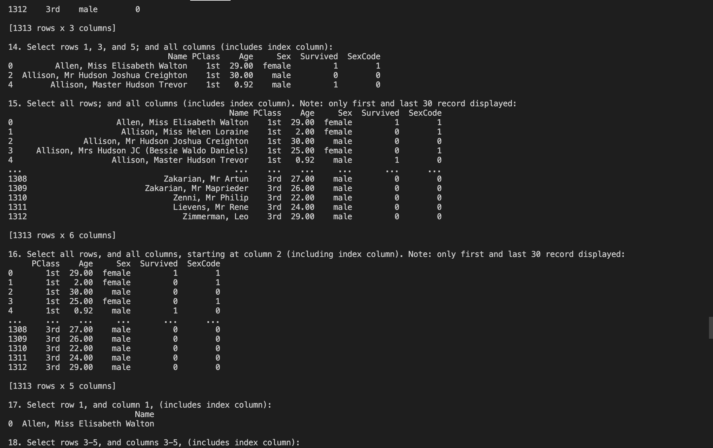
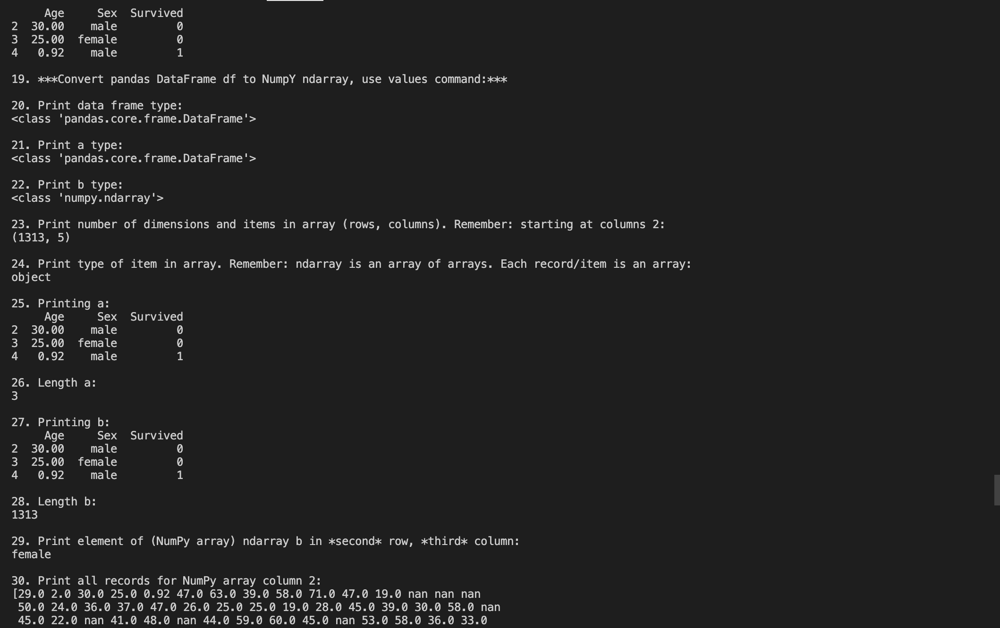
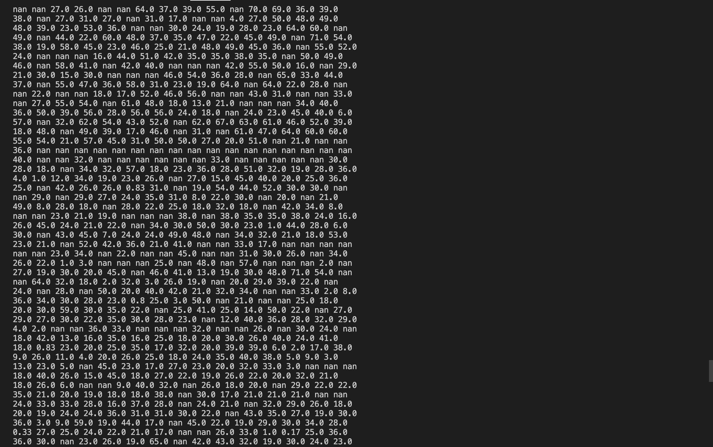

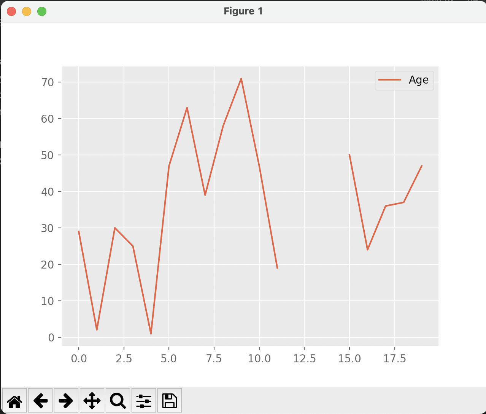

#### *Screenshot of Assignment 4 running in IDLE:

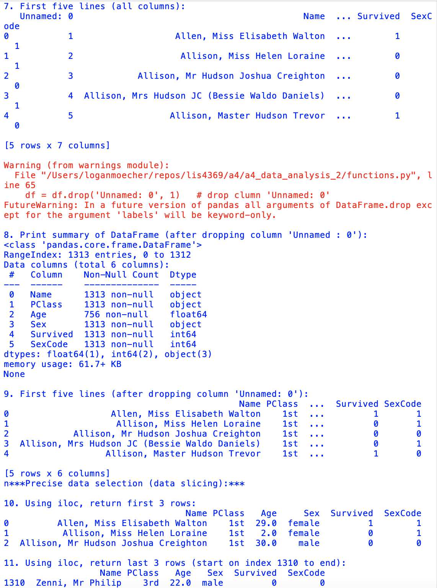
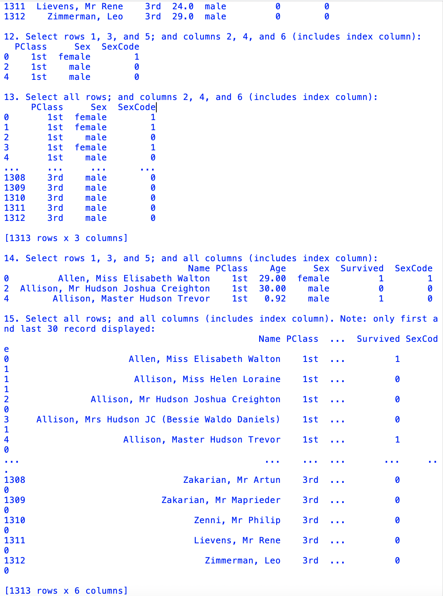
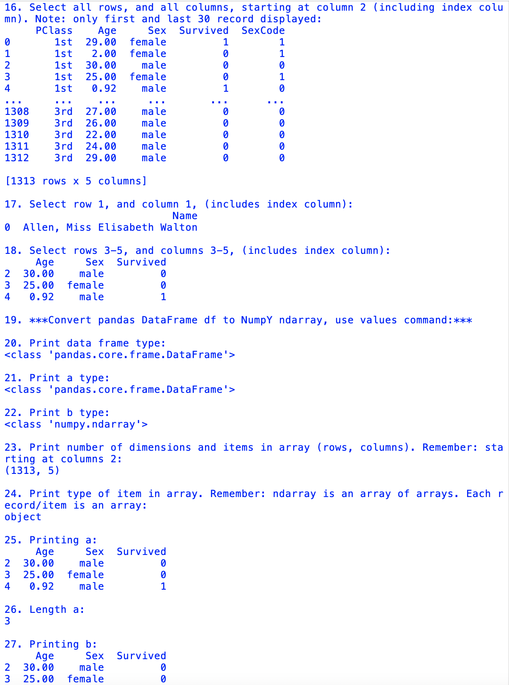
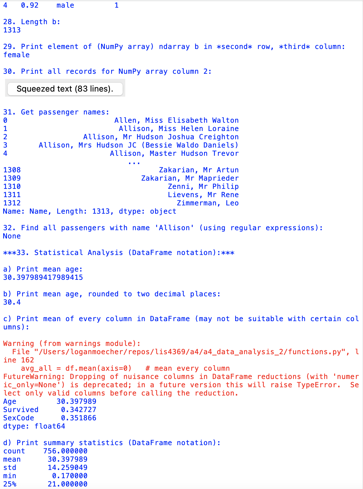
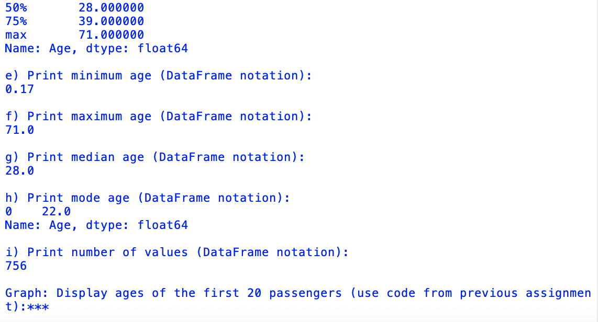

#### *Screenshot of Assignment 4 running in Jupyter Notebook*:

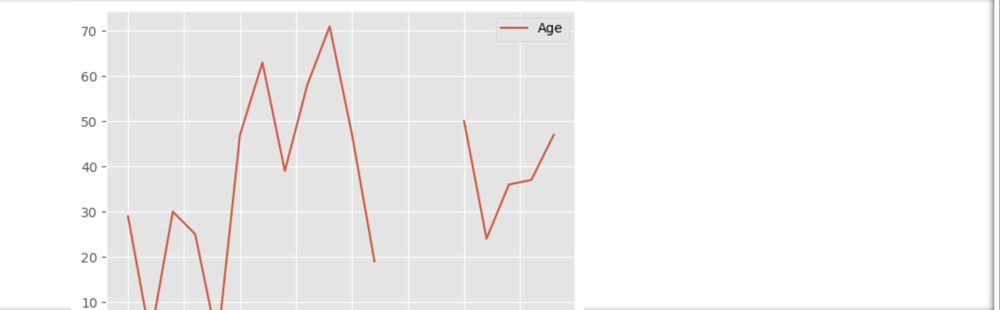

#### Skill sets:

#### *Screenshot of Skill Set 10 running*:

#### *Screenshot of Skill Set 11 running*:

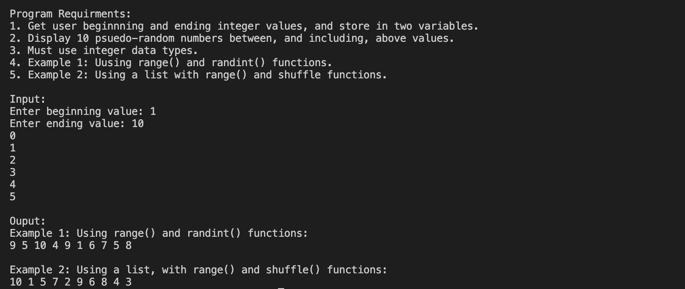

#### *Screenshot of Skill Set 12 running*:

